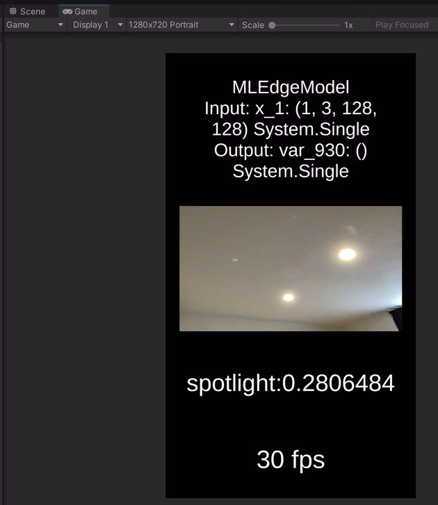
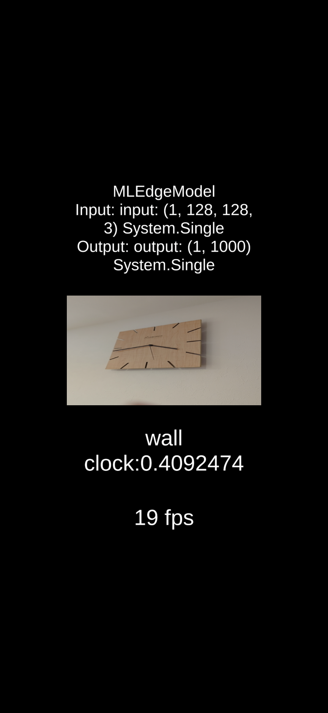

# NatML PlayGround

NatML unity project(s) that runs your local model.

## Snapshots

*FPS display has a bottleneck in camera framerate and webcameraview rendering. inference seems to be much faster. Optimization of image resolution and other hyperparameters may lead to enhancement.*

- OSX (M1 Mac), MobileNetV3_Large_pytorch.coreml 

  </img>

- Android (Google Pixel 7 Pro, Android 13), MobileNetV3_Large_pytorch_float32.tflite

</img>

